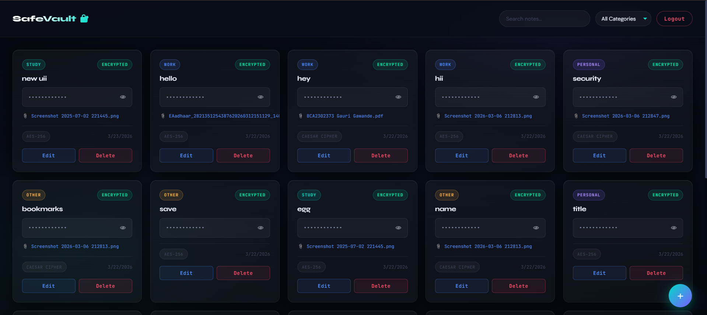

# SafeVault – Secure Notes Web Application

SafeVault is a full-stack web application designed to securely store and manage user notes. It implements authentication, controlled access, and encryption techniques to ensure data confidentiality and security.

---

## Features

* User authentication using JWT (login and signup)
* Protected routes for secure data access
* Create, read, update, and delete notes
* Encryption of sensitive data using AES
* Secure storage using MongoDB

---

## Tech Stack

Frontend: HTML, CSS, JavaScript
Backend: Node.js, Express.js
Database: MongoDB

---

## Project Structure

SafeVault/
BACKEND/
files/
screenshots/
README.md
.gitignore

---
## Screenshots

### Home Page

### Login Page

### Dashboard

## Installation and Setup

1. Clone repository
   git clone https://github.com/pritikoli7350/SafeVault-Secure-Notes-Web-Application.git

2. Navigate to backend
   cd BACKEND

3. Install dependencies
   npm install

4. Create .env file and add:
   MONGO_URI=your_mongodb_connection_string
   JWT_SECRET=your_secret_key

5. Run server
   node server.js

---

## Security Implementation

* JWT-based authentication for secure login
* Encryption applied before storing sensitive data
* Backend validation and authorization
* Protected API routes

---

## Author

Priti Koli
BCA Student – Cybersecurity and Cloud Computing
